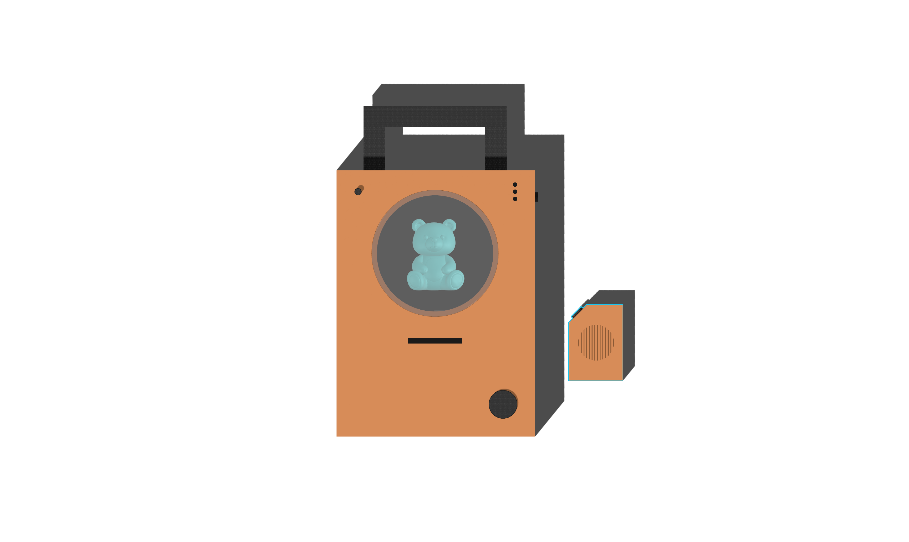

# AI and Family

A workshop to explore creations of devices, installations, or experiences that invite people to explore AI agents within family contexts.



## Installation

The project has three main parts: Raspberry Pi, client, server

- [client](./client/README.md)
- [server](./server/README.md)

## Setup Raspberry Pi

| Clé      | Valeur               |
| -------- | -------------------- |
| Hostname | tales-through-things |
| Username | mdadmin              |
| Password | ma$terDesign+        |

```bash
    ssh mdadmin@tales-through-things.local

    sudo apt update
    sudo apt install -y nodejs npm
    sudo npm install -g yarn

```

### Setup node version

```bash
    sudo npm install -g n
    sudo n 24.14.0
```
