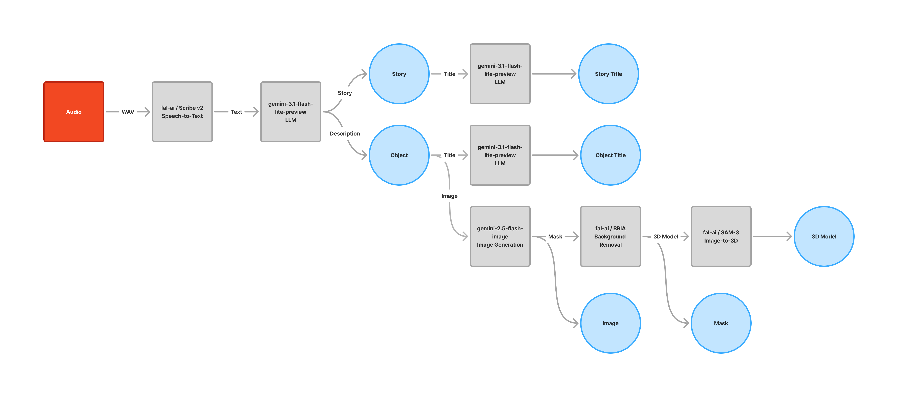

# AI and Family

A workshop to explore creations of devices, installations, or experiences that invite people to explore AI agents within family contexts.


## Installation

The project has three main parts: Raspberry Pi, client, server

- [client](/client/README.md)
- [server](/server/README.md)

## Setup Raspberry Pi

| Clé      | Valeur               |
| -------- | -------------------- |
| Hostname | tales-through-things |
| Username | mdadmin              |
| Password | ma$terDesign+        |

### Setup dev environment

```bash
    ssh mdadmin@tales-through-things.local

    sudo apt update
    sudo apt install -y nodejs npm
    sudo npm install -g yarn

```

### Setup node version

```bash
    sudo npm install -g n
    sudo n 24.14.0
```

## AI Services

| Étape           | Endpoint / Model                           | Type             | Service             | Rôle                              |
| --------------- | ------------------------------------------ | ---------------- | ------------------- | --------------------------------- |
| Speech → Text   | fal-ai/elevenlabs/speech-to-text/scribe-v2 | Speech-to-Text   | FAL.ai / ElevenLabs | Transcription audio               |
| Text → Story    | gemini-3.1-flash-lite-preview              | LLM              | Google Gemini       | Génération d’histoire             |
| Story → Title   | gemini-3.1-flash-lite-preview              | LLM              | Google Gemini       | Génération de titre               |
| Text → Object   | gemini-3.1-flash-lite-preview              | LLM              | Google Gemini       | Génération de description d’objet |
| Object → Title  | gemini-3.1-flash-lite-preview              | LLM              | Google Gemini       | Génération de titre               |
| Object → Image  | gemini-2.5-flash-image                     | Image Generation | Google Gemini       | Génération d’image                |
| Image → Mask    | fal-ai/bria/background/remove              | Image Processing | FAL.ai / BRIA       | Suppression du fond               |
| Mask → 3D Model | fal-ai/sam-3/3d-objects                    | Image-to-3D      | FAL.ai              | Génération modèle 3D              |


